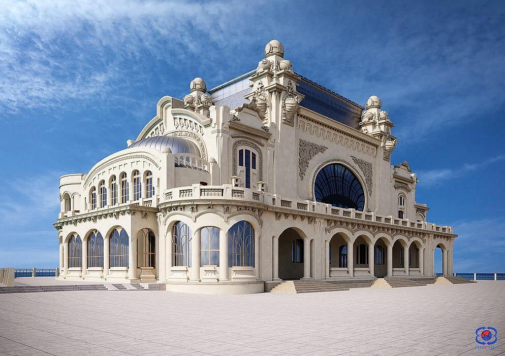

# Neural-Style-Transfer
A notebook for implementing neural style transfer

## Example 1

The content image (The Casino of Constanta)

The style image (The Starry Night)

The result

## Example 2

The content image 

The style image

The result

